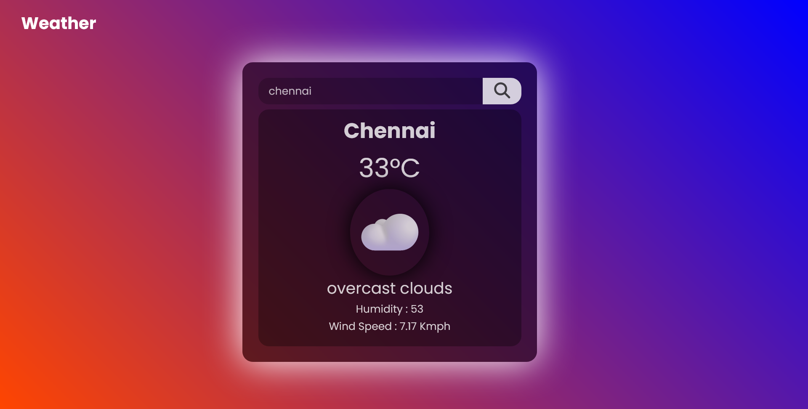

# 🌦️ Weather App – Real-Time Forecast in Your Browser! ⛅

Your personal pocket meteorologist built using **HTML, CSS, JavaScript, and OpenWeather API** 💻✨  
Type any city and get instant weather stats like temperature, conditions, and humidity. It's that simple and that 🔥.

---

## 🌄 Sneak Peek – Project Preview 🖼️

*Clean UI, live weather data, and smooth responsiveness – all in one!*

---

## 🎥 YouTube Walkthrough – Watch It in Action 🎬

▶️ Full demo video  
🔗 https://youtu.be/1NPdRrN2Rx4

Don’t just read the forecast. Build it yourself 🧑‍💻

---

## 🌐 Live Demo – Try It Now 💻

🔗 [Weather App Live](https://rakesh12531.github.io/weather_web_project/)

🌍 Enter any city and instantly know what’s up in the skies ☁️⚡

---

## 🔥 Features That Hit Different

🌡️ Real-time weather data  
🔍 City-based search input  
📦 OpenWeather API integration  
💅 Clean and modern UI  
⚡ Fast, lightweight, and beginner-friendly!

---

## 🛠️ Tech Stack – Powered By

🧱 HTML – Structure of the app  
🎨 CSS – Styling that slaps  
🧠 JavaScript – Fetch API + DOM magic  
🌐 OpenWeather API – Live weather data source  
🚀 GitHub Pages – Hosting like a boss

---

## 👨‍💻 Author – The Dev Behind the Cloud Magic

Made with ☁️ & ❤️ by **Rakesh Raj S.**  
A frontend wizard, IoT tinkerer & full-time code junkie.

📧 Email: [rakeshraj12531@gmail.com](mailto:rakeshraj12531@gmail.com)  
🔗 LinkedIn: [linkedin.com/in/rakesh531](https://linkedin.com/in/rakesh531)  
🐙 GitHub: [github.com/rakeshraj531](https://github.com/Rakesh12531)

---

## 💡 What You'll Learn

📖 How to fetch real-time API data  
🔗 How to handle user input & dynamic DOM updates  
⚙️ Using external APIs like a pro  
💻 Pure HTML, CSS, JS workflow — no frameworks!

---

## 🧪 Wanna Flex?

Fork it. Clone it. Change it. Break it. Fix it.  
Add it to your resume or show off in your next interview 💼

And don’t forget to ⭐ the repo if it gave you even 1% of brain dopamine 😎

---

